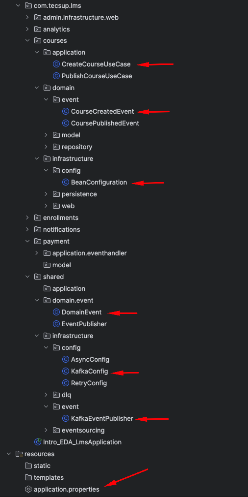
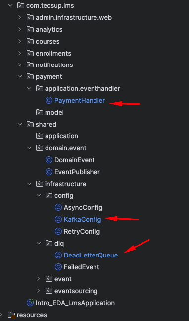

# MIGRACIÓN A KAFKA



## **I.- Creación del servidor de Kafka**

- Creación del docker-compose.yml

```yaml

services:
  zookeeper:
    image: confluentinc/cp-zookeeper:7.5.0
    container_name: zookeeper
    ports:
      - "2181:2181"
    environment:
      ZOOKEEPER_CLIENT_PORT: 2181
      ZOOKEEPER_TICK_TIME: 2000
    volumes:
      - zookeeper-data:/var/lib/zookeeper/data
      - zookeeper-logs:/var/lib/zookeeper/log

  kafka:
    image: confluentinc/cp-kafka:7.5.0
    container_name: kafka
    depends_on:
      - zookeeper
    ports:
      - "9092:9092"
    environment:
      KAFKA_BROKER_ID: 1
      KAFKA_ZOOKEEPER_CONNECT: 'zookeeper:2181'
      KAFKA_LISTENER_SECURITY_PROTOCOL_MAP: PLAINTEXT:PLAINTEXT,PLAINTEXT_HOST:PLAINTEXT
      KAFKA_ADVERTISED_LISTENERS: PLAINTEXT://kafka:29092,PLAINTEXT_HOST://localhost:9092
      KAFKA_OFFSETS_TOPIC_REPLICATION_FACTOR: 1
      KAFKA_AUTO_CREATE_TOPICS_ENABLE: 'true'
    volumes:
      - kafka-data:/var/lib/kafka/data

  kafka-ui:
    image: provectuslabs/kafka-ui:latest
    container_name: kafka-ui
    depends_on:
      - kafka
    ports:
      - "8090:8080"
    environment:
      KAFKA_CLUSTERS_0_NAME: local
      KAFKA_CLUSTERS_0_BOOTSTRAPSERVERS: kafka:29092

volumes:
  zookeeper-data:
  zookeeper-logs:
  kafka-data:

```
Se debe ejecutar el docker-compose.yml con el siguiente comando:

```bash
docker-compose up -d        
```
El servidor se puede visualizar en http://localhost:8090

## **II.- Configuración de una aplicación de Spring Boot para usar Kafka**

1.- Agregar las dependencias en el pom.xml

```xml
    <!-- Spring for Apache Kafka -->
    <dependency>
        <groupId>org.springframework.kafka</groupId>
        <artifactId>spring-kafka</artifactId>
    </dependency>
    
    <dependency>
        <groupId>org.springframework.kafka</groupId>
        <artifactId>spring-kafka-test</artifactId>
        <scope>test</scope>
    </dependency>
```

2.- Configurar las propiedades de Kafka en application.properties

```properties

# Kafka Configuration
spring.kafka.bootstrap-servers=localhost:9092

# Kafka Serializer Configuration
spring.kafka.producer.key-serializer=org.apache.kafka.common.serialization.StringSerializer
spring.kafka.producer.value-serializer=org.springframework.kafka.support.serializer.JsonSerializer

# Kafka Deserializer Configuration
spring.kafka.consumer.key-deserializer=org.apache.kafka.common.serialization.StringDeserializer
spring.kafka.consumer.value-deserializer=org.springframework.kafka.support.serializer.JsonDeserializer

# JSON Configuration
spring.kafka.consumer.properties.spring.json.trusted.packages=*

```
3.- Configurar los tópicos de Kafka en una clase de configuración

KafkaConfig.java

```java


import org.apache.kafka.clients.admin.NewTopic;
import org.springframework.context.annotation.Bean;
import org.springframework.context.annotation.Configuration;
import org.springframework.kafka.annotation.EnableKafka;

/**
 * KafkaConfig
 *
 *             Topic       -->     Particiones
 *       Eventos del curso             3
 *          course.events
 */
@EnableKafka
@Configuration
public class KafkaConfig {

    // Setting topics
    public static final String COURSE_EVENTS_TOPIC = "course.events";

    // Setting Queues/Partitions

    /**
     *  Topic de eventos de cursos
     * @return
     */
    @Bean
    public NewTopic courseEventsTopic() {
        return new NewTopic(COURSE_EVENTS_TOPIC, // topic
                3,  // Nro particiones
                (short) 1  // Nro de replicas
        );
    }

}

```


4.- Implementar un Productor de Eventos con Kafka

- Modificar la clase DomainEvent para agregar el metodo getKey()

DomainEvent.java

```.java

import lombok.Getter;

import java.time.LocalDateTime;
import java.util.UUID;

@Getter
public class DomainEvent {

    private final String eventId;

    private final String eventType;

    private final LocalDateTime ocurredOn;

    public DomainEvent() {
        this.eventId = UUID.randomUUID().toString();
        this.eventType = this.getClass().getSimpleName();
        this.ocurredOn = LocalDateTime.now();
    }
    
    /**
     * Obtener la clave del evento para particionamiento en Kafka
     * @return
     */
    public String getKey() {
        throw new RuntimeException("Method getKey() not implemented");
    }

}

```

- Se requiere modificar la clase CourseCreatedEvent para soportar la serialización con JSON ( Agregar el constructor sin argumentos)    y sorbreescribir el metodo getKey()
  
CourseCreatedEvent.java

```.java

import com.tecsup.lms.shared.domain.event.DomainEvent;
import lombok.Getter;
import lombok.NoArgsConstructor;

@Getter
@NoArgsConstructor  // AGREGAR
public class CourseCreatedEvent extends DomainEvent {
    private  String courseId;   // RETIRAR final
    private  String title;      // RETIRAR final
    private  String instructor; // RETIRAR final

    public CourseCreatedEvent(String courseId, String title, String instructor) {
        super();
        this.courseId = courseId;
        this.title = title;
        this.instructor = instructor;
    }

    @Override          
    public String getKey() {       // SOBREESCRIBIR EL METODO
        return this.courseId;
    }

}


```


- Se requiere crear el publicador de eventos para Kafka

KafkaEventPublisher.java

```.java

import com.tecsup.lms.shared.domain.event.DomainEvent;
import com.tecsup.lms.shared.infrastructure.config.KafkaConfig;
import lombok.RequiredArgsConstructor;
import lombok.extern.slf4j.Slf4j;
import org.springframework.context.ApplicationEventPublisher;
import org.springframework.kafka.core.KafkaTemplate;
import org.springframework.stereotype.Component;

@Slf4j
@Component
@RequiredArgsConstructor
public class KafkaEventPublisher {

    //private final ApplicationEventPublisher publisher;
    private final KafkaTemplate<String, DomainEvent> kafkaTemplate;

    public void publish(DomainEvent event) {
        log.info("Publicando: {} [{}]", event.getEventType(), event.getEventId());

        //publisher.publishEvent(event);
        String key = event.getKey(); // devuelva el course Id

        kafkaTemplate.send(
                KafkaConfig.COURSE_EVENTS_TOPIC,
                key,
                event
        );

        // La key sirve para identificar a que particion va el mensaje
        // HASH(key) % N_PARTICIONES = particion

    }
}

```

- Adaptar la clase CreateCourseUseCase.java

```.java


import com.tecsup.lms.courses.domain.event.CourseCreatedEvent;
import com.tecsup.lms.courses.domain.model.Course;
import com.tecsup.lms.courses.domain.repository.CourseRepository;
import com.tecsup.lms.shared.infrastructure.event.KafkaEventPublisher;
import lombok.RequiredArgsConstructor;
import lombok.extern.slf4j.Slf4j;

import java.time.LocalDateTime;

@Slf4j
@RequiredArgsConstructor
public class CreateCourseUseCase {

    private final CourseRepository repository;

    //private final EventPublisher eventPublisher;
    private final KafkaEventPublisher eventPublisher;

    public Course createCourse(String title, String description, String instructor) {

        Course course = Course.builder()
                .title(title)
                .description(description)
                .instructor(instructor)
                .status(Course.CourseStatus.DRAFT)
                .createdAt(LocalDateTime.now())
                .build();

        Course saved = repository.save(course);
        log.info("Course created: {}", saved.getId());

        // Publicar el evento
        eventPublisher.publish(
                new CourseCreatedEvent(
                        saved.getId().toString(),
                        saved.getTitle(),
                        saved.getInstructor()
                )
        );

        return saved;
    }

}

```

- Adaptar la clase BeanConfiguration.java

```.java


import com.tecsup.lms.courses.application.CreateCourseUseCase;
import com.tecsup.lms.courses.application.PublishCourseUseCase;
import com.tecsup.lms.courses.domain.repository.CourseRepository;
import com.tecsup.lms.shared.domain.event.EventPublisher;
import com.tecsup.lms.shared.infrastructure.event.KafkaEventPublisher;
import org.springframework.context.annotation.Bean;
import org.springframework.context.annotation.Configuration;

/**
 * CONFIGURACIÓN DE BEANS
 * 
 * Registra los Use Cases y Domain Services como beans de Spring.
 * 
 * Nota: Lombok @RequiredArgsConstructor se encarga de la inyección,
 * aquí solo creamos las instancias.
 */
@Configuration
public class BeanConfiguration {

    @Bean
    public CreateCourseUseCase createCourseUseCase(CourseRepository repository, KafkaEventPublisher eventPublisher) {
        return new CreateCourseUseCase(repository, eventPublisher);
    }

    @Bean
    public PublishCourseUseCase publishCourseUseCase(CourseRepository repository, EventPublisher eventPublisher) {
        return new PublishCourseUseCase(repository, eventPublisher);
    }
}

```

5.- Adaptación del Consumidor CourseEventHandler.java  para soporte de Kafka 

CourseEventHandler.java

```.java

import com.tecsup.lms.courses.domain.event.CourseCreatedEvent;
import com.tecsup.lms.shared.domain.event.DomainEvent;
import com.tecsup.lms.shared.infrastructure.config.KafkaConfig;
import lombok.extern.slf4j.Slf4j;
import org.springframework.kafka.annotation.KafkaListener;
import org.springframework.stereotype.Component;

@Slf4j
@Component
public class CourseEventHandler {

    @KafkaListener(
            topics = KafkaConfig.COURSE_EVENTS_TOPIC, // Topico a escuchar
            groupId = "course-notifications-group"    // Grupo de consumidores
    )
    public void handleCourseEvents(DomainEvent event) {
        if (event instanceof CourseCreatedEvent) {
            handleCourseCreated((CourseCreatedEvent) event);
        } else {
            throw  new RuntimeException("Evento no manejado: " + event.getEventType());
        }

    }

    /**
     *  Maneja el evento de curso creado
     * @param event
     */
    public void handleCourseCreated(CourseCreatedEvent event) {
        log.info("Manejando evento de curso creado: {} - {} - {}",
                event.getCourseId(),
                event.getTitle(),
                event.getInstructor()
        );
        // Aquí se podría agregar la lógica para enviar notificaciones, por ejemplo.

        sendEmailNotification(event);
    }

    private void sendEmailNotification(CourseCreatedEvent event) {
        // Lógica simulada para enviar un correo electrónico
        log.info("Enviando notificación por correo electrónico para el curso creado: {} - {}",
                event.getCourseId(),
                event.getTitle()
        );
    }
    
}

```

6.- Realizar pruebas de integración con Kafka


## **III.- Ejercicio**

Implementar la publicación y consumo con Kakfa para el  evento : Publicación de Curso.

# DLQ  EN KAFKA




### 1.- Crear el tópico DLQ

KafkaConfig.java

``` .java

import org.apache.kafka.clients.admin.NewTopic;
import org.springframework.context.annotation.Bean;
import org.springframework.context.annotation.Configuration;
import org.springframework.kafka.annotation.EnableKafka;
import org.springframework.kafka.config.TopicBuilder;

/**
 * KafkaConfig
 *
 *             Topic       -->     Particiones
 *       Eventos del curso             3
 *          course.events
 */
@EnableKafka
@Configuration
public class KafkaConfig {

    // Setting topics
    public static final String COURSE_EVENTS_TOPIC = "course.events";

    // DLQ
    public static final String DLQ_COURSE_EVENTS_TOPIC = "dlq.course.events";  // ✅ DLQ Topic

    // Setting Queues/Partitions

    /**
     *  Topic de eventos de cursos
     * @return
     */
    @Bean
    public NewTopic courseEventsTopic() {
        return new NewTopic(COURSE_EVENTS_TOPIC, // topic
                3,  // Nro particiones
                (short) 1  // Nro de replicas
        );
    }

    // DLQ
    @Bean
    public NewTopic dlqCourseEventsTopic() {
        return TopicBuilder.name(DLQ_COURSE_EVENTS_TOPIC)
                .partitions(1)
                .replicas(1)
                .build();
    }

}

```

### 2.- Migrar al DLQ a Kafka


DeadLetterQueue.java

``` .java

import com.tecsup.lms.shared.domain.event.DomainEvent;
import com.tecsup.lms.shared.infrastructure.config.KafkaConfig;
import lombok.RequiredArgsConstructor;
import lombok.extern.slf4j.Slf4j;
import org.springframework.kafka.core.KafkaTemplate;
import org.springframework.stereotype.Component;

import java.util.ArrayList;
import java.util.HashMap;
import java.util.List;
import java.util.Map;
import java.util.concurrent.ConcurrentLinkedQueue;

@Slf4j
@Component
@RequiredArgsConstructor
public class DeadLetterQueue {

    private final KafkaTemplate<String, Object> kafkaTemplate;
    private final ConcurrentLinkedQueue<FailedEvent> failedEvents = new ConcurrentLinkedQueue<>();

    public void add(DomainEvent event, Exception exception, String originalTopic, long originalOffset) {

        FailedEvent failedEvent = new FailedEvent(
                event,
                exception.getMessage(),
                System.currentTimeMillis()
        );

        failedEvents.add(failedEvent);

        log.info("🗳️ Event added to DLQ: {} [{}]", event.getEventType(), event.getEventId());

        // Enviar a Kafka DLQ topic
        sendToKafkaDLQ(event, exception, originalTopic, originalOffset);

    }

    private void sendToKafkaDLQ(DomainEvent event, Exception exception, String originalTopic, long originalOffset) {
        // Construir el mensaje DLQ

        // Crear mensaje DLQ con metadata completa
        Map<String, Object> dlqMessage = new HashMap<>();

        // Información del evento original
        dlqMessage.put("eventId", event.getEventId());
        dlqMessage.put("eventType", event.getEventType());
        dlqMessage.put("aggregateId", event.getKey());
        dlqMessage.put("originalEvent", event);

        // Enviar a Kafka DLQ
        kafkaTemplate.send(
                KafkaConfig.DLQ_COURSE_EVENTS_TOPIC,
                event.getKey(),
                dlqMessage
        );
        log.info("🗳️ Event sent to Kafka DLQ: {} [{}]", event.getEventType(), event.getEventId());

    }
    
    public List<FailedEvent> getFailedEvents() {

        return new ArrayList<>(failedEvents);
    }
}

```

3.- Adaptar el PaymentHandler para usar DLQ


PaymentHandler.java

``` .java

import com.tecsup.lms.courses.domain.event.CoursePublishedEvent;
import com.tecsup.lms.shared.domain.event.DomainEvent;
import com.tecsup.lms.shared.infrastructure.config.KafkaConfig;
import com.tecsup.lms.shared.infrastructure.dlq.DeadLetterQueue;
import lombok.RequiredArgsConstructor;
import lombok.extern.slf4j.Slf4j;
import org.springframework.kafka.annotation.DltHandler;
import org.springframework.kafka.annotation.KafkaListener;
import org.springframework.kafka.annotation.RetryableTopic;
import org.springframework.kafka.support.KafkaHeaders;
import org.springframework.messaging.handler.annotation.Header;
import org.springframework.retry.annotation.Backoff;

import org.springframework.stereotype.Component;

import java.util.Random;

@Slf4j
@Component
@RequiredArgsConstructor
public class PaymentHandler {

    private final Random random = new Random();

    private final DeadLetterQueue dlq;

    @RetryableTopic(
            attempts = "2", // Numero de reintentos
            backoff = @Backoff(
                    delay = 2000,      // Tiempo inicial de espera
                    multiplier = 2.0   // Multiplicador exponencial
            ),
            autoCreateTopics = "false",
            dltTopicSuffix = "-dlt", // Sufijo para el topico de DLQ
            include = RuntimeException.class
    )
    @KafkaListener(
            topics = KafkaConfig.COURSE_EVENTS_TOPIC, // Topico a escuchar
            groupId = "payment-service-group"    // Grupo de consumidores
    )
    public void handleCourseEvents(DomainEvent event) throws InterruptedException  {
        if (event instanceof CoursePublishedEvent) {
            handleCoursePublished((CoursePublishedEvent) event);
        }

    }

    public void handleCoursePublished(CoursePublishedEvent event) throws InterruptedException {
        log.info("[{}] Processing payment ...", Thread.currentThread().getName());

        if (random.nextBoolean()) {
            log.info("Payment processing taking longer than expected...");
            throw new RuntimeException("Payment processing failed due to timeout");
        }

        log.info("Payment finished for course: {}", event.getTitle());

    }

    /**
     * Manejador de Dead Letter Queue
     * @param event
     * @param e
     */
    @DltHandler
    public void dltHandler(
            DomainEvent event,
            @Header(KafkaHeaders.RECEIVED_TOPIC) String topic,
            @Header(KafkaHeaders.OFFSET) long offset,
            @Header(KafkaHeaders.EXCEPTION_MESSAGE) String errorMessage) {

        log.error("💀 [PAYMENT-DLT] All retries exhausted - Sending to DLQ");

        // Enviar a DLQ para procesamiento manual
        RuntimeException exception = new RuntimeException(errorMessage);
        dlq.add(event, exception, topic, offset);
    }
    
}

```
4.- Retirar librerias del pom.xml que ya no se usan

``` xml

    <!-- Retirar estas dependencias -->

        <!-- Spring Retry -->
        <dependency>
            <groupId>org.springframework.retry</groupId>
            <artifactId>spring-retry</artifactId>
            <version>2.0.4</version>
        </dependency>
        <dependency>
            <groupId>org.springframework</groupId>
            <artifactId>spring-aspects</artifactId>
        </dependency>
        
```

5.- Realizar pruebas con la siguiente secuencia:

- Crear un curso a traves del evento de CourseCreatedEvent
- Publicar el curso a traves del evento CoursePublishedEvent